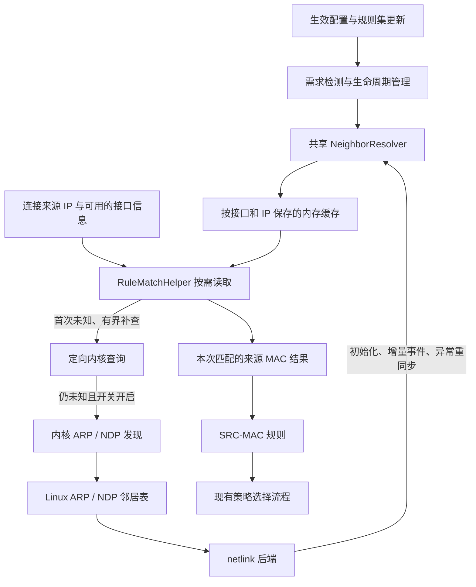

# SRC-MAC 设计目标与整体架构

状态：邻居表缓存、首次未命中定向补查和可选主动探测均已实现；验证范围见第 9 节，真实路由器首连接测量尚未完成。

设计分支：`feat/src-mac`。

目标平台：首版 Linux / OpenWrt；不据此承诺 Android 客户端可用。

维护约定：后续发现影响本功能的源码事实、更合适的实现或实测结论时，直接更新本文。明确区分已确定设计、候选方案与尚未验证的推断，保留参考版本及变更依据。

## 1. 背景与目标

为 mihomo 增加来源 MAC 地址分流规则，支持按局域网设备选择代理策略。当设备的 IPv4 地址或 IPv6 隐私地址变化时，只要新的地址能通过系统邻居表解析到同一 MAC，原规则即可继续适用。

```yaml
rules:
  - SRC-MAC,AA:BB:CC:DD:EE:FF,Proxy
  - SRC-MAC,12:22:33:44:55:66,DIRECT
  - MATCH,DIRECT
```

这里的 `Proxy` 指用户配置中已有的代理或策略组。

设计目标：

- 同时支持 IPv4 ARP 和 IPv6 NDP 邻居信息。
- 使用系统原生 netlink API，以事件订阅维护共享缓存。
- 缓存命中只访问内存；首次未命中时限时读取内核记录，主动探测由顶层开关控制。运行时不执行外部命令。
- 支持普通规则、逻辑规则、子规则和 classical 规则集。
- 仅在生效的配置需要来源 MAC 时启用服务，支持配置与规则集热更新。
- 对未知或有歧义的映射返回未命中，避免把其他设备的 MAC 用于匹配。

## 2. 首版范围与语义

- 仅实现 `SRC-MAC`，精确匹配 48 位以太网 MAC。
- 配置解析时校验地址，接受冒号、短横线及点分组格式，大小写不敏感；输出统一为小写冒号格式。
- 不加入 MAC 前缀、通配符或 `DST-MAC`。
- 首版不扩展设备主机名、DHCP 租约解析、DNS 来源设备规则或 eBPF 数据采集。
- MAC 查询后端首先支持 Linux / OpenWrt；其他平台保持可编译，当前没有可用后端时，顶层配置 `SRC-MAC` 会返回不支持错误。classical provider 沿用现有容错行为：记录解析警告并跳过不支持的条目；不会因此启用空后端。后续平台通过新增后端或宿主客户端注入能力接入，不把规则语法永久绑定到 Linux。
- 现有 TUN `include-mac-address` / `exclude-mac-address` 与本功能分别工作：前者控制流量进入 TUN，后者在 mihomo 路由规则中选择策略。

规则识别的是来源 IP 对应的邻居设备。适用场景是 mihomo 能看到客户端真实来源 IP，且客户端与其处于可解析邻居的链路上。跨路由、经过来源 NAT、代理转发或代理 NDP 的场景，不能保证恢复原始终端 MAC；不得把下一跳网关 MAC 当作原始终端 MAC。

IPv6 地址变化可由新邻居事件跟踪，但不能保证首次连接立即命中。缓存查不到时按第 5 节执行有界补救，仍无法确定 MAC 时，`SRC-MAC` 返回未命中，继续正常规则匹配。若后续规则选中直连，缓存更新不会自动把已经建立的连接切换到代理。设备自身 MAC 变化仍需要调整规则。

`NOT` 保持现有布尔语义：MAC 未知时，`SRC-MAC` 为假，其外层 `NOT` 为真。不能把单条规则的“未知不命中”理解为整个逻辑表达式都不命中。

## 3. 与已有实现的关系

### mihomo PR #1406

保留其 `SRC-MAC,<MAC>,<策略>` 配置形式。底层采用原生 API 和事件更新，避免执行 `ip neigh` / `arp` / `netsh` 后解析文本，也不采用固定五分钟刷新作为正常更新路径。

### sing-box 源码核对（2026-09-22）

参考 `source_mac_address` 和共享邻居解析服务，尤其是按需启用、平台后端与规则匹配分离。本地参考源码位于同级目录 `../sing-box`，核对版本为 `testing` 分支提交 `05ac15137d3b710a40f5ba4da4efedab1afc0f31`，不是 `1.14.0-alpha.1` 标签。

已确认的 Linux 原生后端行为：

- `route/neighbor_resolver_linux.go`：使用 `sync.RWMutex` 和按 IP 索引的 map；查询依次尝试邻居缓存、DHCP 租约、EUI-64 推导，失败立即返回，没有查询未命中后的系统补查或等待。
- `Start` 先全量读取邻居表，再启动订阅。两步之间存在遗漏事件的可能，本方案应避免这个启动间隙。
- 通过 `jsimonetti/rtnetlink` 读取邻居表、`mdlayher/netlink` 订阅事件，并非直接使用 `sagernet/netlink.NeighSubscribe`。
- 接收循环中的三秒是 read deadline；通知到达即可处理，不是三秒刷新周期，也不是未命中窗口的上限。
- 接收错误后记录日志并继续循环，未看到丢事件后全量重同步；订阅创建失败则直接退出该监听函数。
- `route/neighbor_table_linux.go` 未保留接口编号，解析事件时也未按 NUD 状态区分有效性。本方案保留接口维度与明确的状态处理。
- `route/route.go` 在规则判断前补充来源 MAC；`route/rule/rule_item_source_mac_address.go` 在元数据没有 MAC 时返回不匹配。

以上潜在问题来自源码审查，尚未通过运行测试复现，不据此推断实际失败频率。

DHCP 租约和 EUI-64 不能作为动态 IPv6 隐私地址的通用补救。SLAAC 临时地址通常没有对应 DHCP 租约，其随机接口标识也不应按 EUI-64 猜测 MAC。因此首版仍以系统邻居信息为依据，不自动增加这两种回退。

复用判断：优先参考实现结构并复用底层库，不整体引入 sing-box 的 `route` 包。参考版本要求 Go 1.25.5，而 mihomo 的 `go.mod` 声明 Go 1.20。mihomo 已依赖 `mdlayher/netlink v1.7.2`、`jsimonetti/rtnetlink v1.4.0`，也有 `sagernet/netlink` 间接依赖；本次采用 `mdlayher/socket` 的可取消 netlink 收发、`mdlayher/netlink` 的消息编码和 `jsimonetti/rtnetlink` 的属性解析，沿用已有版本。没有引入 sing-box 路由组件或其 DHCP/EUI-64 回退。

### 为什么流量经过 mihomo，仍需要查询 MAC

局域网以太网帧到达路由器时含有来源 MAC；操作系统处理外层链路信息后，TUN 向程序交付 IP 数据包，普通 TCP/UDP socket 则交付连接或数据报。当前 mihomo 的这些入口没有把原始 Ethernet 来源 MAC 传递到路由元数据。

因此，“路由器收到过带 MAC 的帧”不等于“mihomo 收到的连接对象中有 MAC”，也不等于“系统已将每个新来源 IP 与 MAC 写入邻居表”。现有架构通过邻居表补全这项信息，属于分层接口下的折中，不是 MAC 本身难以读取。

更早地采集数据包也是候选方向，例如在 LAN 接口通过 AF_PACKET 旁路观察 `(接口, IP, MAC)`，或通过 TC/eBPF 在进入 TUN 前记录映射。详细区别与传递成本见 4.6。首版暂不采用，只有实测表明邻居方案不足时再评估。

## 4. 整体架构



### 4.1 共享邻居解析组件

新增 `component/neighbor/`，分离通用缓存逻辑和 Linux 系统访问：

- 通用层：地址规范化、缓存、接口歧义判断、并发访问及服务状态。
- Linux 后端：订阅邻居、接口及接口地址变化，同步已有条目，处理删除、错误恢复和关闭；独立查询 socket 执行定向补查和内核探测。
- 其他平台：提供不支持该功能的实现，保证跨平台构建。

主要接口如下：

```go
type MAC [6]byte

type NeighborKey struct {
    IfIndex int
    IP      netip.Addr
}

// ifIndex 为 0 表示未知。Lookup 只读取内存。
func (r *Resolver) Lookup(ifIndex int, ip netip.Addr) (MAC, bool)

// Resolve 缓存未命中时执行有界补救，支持取消。
func (r *Resolver) Resolve(ctx context.Context, ifIndex int, ip netip.Addr) (MAC, bool)
```

首版在进程所在网络命名空间中查询邻居。未来若支持多个网络命名空间，应按命名空间隔离解析器或扩展缓存键。

### 4.2 接口与地址歧义

主缓存按 `(ifindex, netip.Addr)` 保存映射，规范化 IPv4-mapped IPv6 地址。IPv6 zone 需要保留其接口含义，不能直接丢弃。

- 有可靠来源接口信息：精确匹配接口与 IP。
- 没有来源接口信息：通过辅助 IP 索引查询，只接受无歧义的结果；首版可保守限定为仅存在一个有效接口条目。
- 相同地址在不同接口出现时，不能任意取第一条。邻居新增事件引用尚未知的接口时，清空缓存并重同步；不能直接忽略该条目，否则其他接口上的同 IP 可能被误认为唯一结果。
- `InIP`、TUN 接口编号和按源地址查出的回程接口均不直接等同于真实 ingress ifindex。

当前元数据缺少通用的来源接口编号。首版可先使用无歧义 IP 查询；若增加 `SrcIfIndex`，必须同时明确哪些入口能可靠填充。每次规则匹配执行路由查询不属于本方案。

### 4.3 规则与元数据

在 `constant/rule.go` 注册 `SrcMAC`，在 `rules/parser.go` 增加 `SRC-MAC` 分支，由 `rules/common/src_mac.go` 完成配置校验和规范化字符串比较。

在 `RuleMatchHelper` 增加类似 `FindProcess` 的按需来源 MAC 查询入口，并在 `tunnel.resolveMetadata` 中接入共享解析器。一次规则匹配过程最多执行一次来源 MAC 解析，解析完成后固定成功或失败结果，保证同一次逻辑规则求值使用一致的结果。缓存读取、定向补查和可选探测均归入这一次解析，不允许每条规则分别重试。

`Metadata.SrcMAC` 保存小写冒号格式，通过连接 API 的可选 `sourceMAC` 字段输出，未知时省略。缓存内部使用 `[6]byte`，每次分流首次查询成功后转换一次字符串，规则比较不再解析字符串。未执行到 MAC 规则的连接不会仅为了展示而查询 MAC。

查询 helper 在开始分流时捕获原始来源 IP；即使 `RULE-SET,src` 临时交换来源和目标 IP，MAC 仍代表原始客户端。内部 `INNER` 连接跳过查询。首版没有添加 `SrcIfIndex`，默认按唯一有效接口条目判断；来源 IPv6 地址带 zone 时使用对应接口。

规则构造与配置校验只创建规则对象，不启动监听器或后台 goroutine。规则在缺少 helper、来源 IP 或 MAC 时也应安全返回未命中。

### 4.4 查询触发、等待和规则顺序

“来源 MAC 已知，但不等于规则中的 MAC”与“来源 MAC 无法解析”必须区别处理：前者是正常不匹配，不需要补查，更不能反复探测直到找到规则中列出的设备。

| 场景 | 当前行为 |
| --- | --- |
| 生效配置没有 `SRC-MAC` | 不启动解析服务，不查询或探测 MAC |
| 本次分流不需要判断 `SRC-MAC` | 不触发连接级 MAC 查询，不增加等待 |
| 来源 MAC 已知，匹配或不匹配某条规则 | 立即按规则结果处理，不补查 |
| 实际需要判断 `SRC-MAC`，来源 MAC 尚未知 | 最多执行一次有总时间预算的来源解析，再固定结果 |
| 补查失败、超时、资源限额已满或接口映射有歧义 | 作为未知继续规则匹配，不自动拒绝、不指定默认直连 |

“继续规则匹配”遵循用户后续规则。若后续是 `MATCH,DIRECT` 则直连，若是其他策略则使用相应策略，不绕过后续规则。普通规则顺序、逻辑短路、Direct/Global 模式和显式指定代理保持原有语义。

实现采用配置引用快照：开始分流时短暂持有 `configMux.RLock`，捕获规则、子规则、代理和 provider 映射后释放锁；这些集合在配置更新时整体替换。仅在真正执行到 MAC 条件时，helper 等待解析，在同一处继续求值，不重跑带 REMATCH 等副作用的规则。provider 的不可变策略在本次求值首次引用该 provider 时固定，后续引用复用；这不是在连接开始时复制所有 provider 的内容。代理组的动态选择及规则禁用状态仍沿用原有机制。

连接级 context、服务停用或探测设置变化可结束等待。相同来源的并发补救共享任务，一个等待者取消不影响其他等待者；最后一个等待者退出则取消任务。共享任务沿用首个请求的截止时间，后加入者不会延长任务寿命。UDP 使用新会话 sender 的 context，等待发生在会话建立 goroutine，不阻塞共享收包线程。TCP 利用已有 peek 阶段发现的致命网络错误取消；它不能立即感知所有远端关闭情形，例如数据已缓冲或仅收到半关闭，此时仍以总超时为界。单纯 EOF 不作为致命错误，保留 TCP 半关闭语义。

### 4.5 跨平台扩展边界

规则解析、MAC 比较、共享缓存、接口歧义检查以及启停需求检测属于通用层。平台后端负责读取系统记录、跟踪变化、转换邻居状态和释放系统资源，不让通用层依赖 Linux netlink 消息或 `unix.NUD_*` 常量。

后端向通用层提供标准化的接口标识、IP、MAC、有效性和添加/删除信息，并明确初始化是否完成、缓存是否可信。平台之间的原生状态字段不必逐个对应，但必须转换为一致的匹配语义。接口标识仅在相应后端与运行环境内有效，设备移除或编号复用时必须失效旧记录。

| 平台 | 已核对的可行路径 | 主要待解决项 |
| --- | --- | --- |
| Linux / OpenWrt | netlink 读取与订阅邻居表 | 当前首版目标，完善同步、异常恢复和首次未命中处理 |
| macOS | sing-box 使用 `x/net/route.FetchRIB` 读取 IPv4/IPv6 邻居，通过 `AF_ROUTE` 接收更新 | 适配状态、接口与 zone，验证权限、运行方式和系统版本；不能把所有图形客户端沙箱等同于命令行程序 |
| Windows | 官方 `GetIpNetTable2` 支持 IPv4/IPv6 全表读取，`GetIpNetEntry2` 支持单条查询 | 读取可行，但与 Linux 等价的邻居变化订阅路径尚未确认；需单独设计缓存刷新、失效和查询策略 |
| Android | 可考虑受支持的宿主客户端提供邻居信息；sing-box 已有平台回调接口 | 受系统版本、权限、SELinux 与热点实现影响，不能因基于 Linux 就自动宣称可用 |
| iOS 等其他平台 | 本次尚未核对可用的受支持后端 | 不承诺支持，后续按宿主能力和实际使用场景评估 |

2026-09-22 核对的 sing-box macOS 实现位于 `route/neighbor_resolver_darwin.go` 和 `route/neighbor_table_darwin.go`；`route/neighbor_resolver_platform.go` 展示了宿主向核心提供邻居更新的接口。所核对版本的原生 Windows 构造路径仍是未支持 stub，不能当作现成 Windows 实现移植。

Windows 的路由变化通知不等于邻居表变化通知，不能用 `NotifyRouteChange2` 代替后就宣称缓存实时更新。如果后续采用定期读取或短期缓存加按需查询，必须明确其更新时效差异；Linux 首版仍采用事件驱动。首次缓存未命中的补查能力也应单独声明，不能要求所有后端默认具备。

sing-box 官方 Android 使用说明要求受支持的图形客户端、Android 11+、ROOT 和 VPNHotspot 配合；这是其实现路径的条件，不是 mihomo 已支持 Android 的证据。macOS 图形客户端的分发与系统扩展条件也需与原生后端分开说明。

编译隔离要显式考虑 Android 与 Linux、iOS 与 Darwin 的 Go 构建标签关系，避免仅靠 `_linux.go` / `_darwin.go` 文件名把尚未验证的移动平台误判为支持。运行时还须区分“未实现后端”与“已实现但当前进程无权限”，配置检查不应为了判断能力就启动后台监听。

扩展顺序建议先完成 Linux 验证，再优先评估已有参考实现的 macOS，Windows 单独验证更新机制。通用层现在保持清晰边界即可，不预先实现所有平台适配。

### 4.6 提前采集 MAC 与 TUN 的关系

TUN 本身不交付 Ethernet 头，无法直接从 TUN 数据包中读出原始客户端 MAC。当前 mihomo 在 `listener/sing_tun/server.go` 创建 TUN 及协议栈，经 `listener/sing_tun/dns.go` 的 handler 转入 `listener/sing`，后者根据来源/目标地址构建连接元数据，没有原始来源 MAC 的传递字段。切换 TUN 的协议栈实现不会凭空恢复缺失的二层信息。

提前采集方案仍可保留当前 TUN 转发路径，但需在可见原始以太网头的 LAN 接收位置额外挂接采集器：

```text
客户端以太网帧（包含 MAC、IP）
    → LAN 入口采集并记录来源信息
    → 原有系统路由 / TUN / 协议栈
    → mihomo 根据来源信息查采集记录
    → 填充来源 MAC，执行 SRC-MAC 规则
```

| 方案 | 记录来源 | 对首次连接的帮助 | 额外成本 |
| --- | --- | --- | --- |
| 邻居表订阅 | 系统已有 ARP/NDP 记录 | 取决于内核是否已学到映射及通知是否已处理 | 系统后端、缓存和恢复逻辑 |
| AF_PACKET 旁路采集 | LAN 接收数据包的副本 | 不依赖先建立邻居项，但用户态处理副本可能落后于分流判断 | 采集权限、接口管理、过滤和解析、收包队列与丢包处理 |
| TC ingress/eBPF 记录 | 原始数据包经过内核入口时同步执行 | 在挂接点确实覆盖该流量、写入成功且关联正确的前提下，可先记录再让包继续前进 | BPF 程序和 map、加载/挂接、内核兼容、关联与读取、清理和恢复 |

AF_PACKET 在协议处理前获得数据包，并不意味着用户态采集 goroutine 一定先于 TUN 处理 goroutine 执行。不能仅靠更早收到副本就保证第一条连接已经可查询。

TC/eBPF 若在继续处理原包前完成 map 写入，能够消除这段用户态采集调度差；但之后若只通过异步事件复制到 Go 缓存，仍会出现新的先后问题。若要求首次判断能看到刚写的结果，就需在缓存未命中时读取 BPF map，或设计可靠的同步传递。读取 BPF map 可能引入系统调用，不能继续笼统宣称所有查询均是 Go 内存访问。

采集点得到的接口信息与 TUN 可见信息也必须能够关联：TUN 接口编号不是原始 LAN 接口编号。仅有来源 IP 时仍需处理重叠地址；若改用流标识，应验证 IPv4/IPv6 分片、地址或端口改写、双向流量及会话复用，不能假设一个五元组可覆盖所有情况。单纯把 skb mark 设置好，也不会让普通 TUN 字节流自动附带该 mark。

采集后端需选择真正看到客户端入站帧的位置，处理 bridge/VLAN、虚拟接口、重复观测、硬件卸载及接口变化，避免将路由器自身发出的帧重新学习成客户端身份。记录需要有容量和生命周期管理；没有匹配需求时不加载或挂接，关闭时只撤销本功能拥有的资源。

TAP 与 TUN 不同，能够交付以太网帧；但要看到客户端原始 MAC，必须把原始二层帧送进相应 TAP/桥接路径。把现有 TUN 换个名称或在配置中切换协议栈不会变成 TAP。采用 TAP 需要重新设计二层接入、桥接及协议处理，不作为增加 `SRC-MAC` 的首版路线。

评估结论：在需要显著提高冷启动或新地址首连接识别率时，TC/eBPF 是比纯旁路抓包更值得验证的增强后端；仍需证明覆盖范围和关联正确性，不宣称无条件 100% 命中。规则和元数据层可继续复用，额外复杂度集中在采集与可靠传递部分。此为备选架构，不改变当前首版范围。

## 5. 缓存一致性与故障恢复

### 5.1 首次未命中的原因与定向补查

必须区分两种情况：

| 原因 | 已实现的补救 |
| --- | --- |
| 内核已有有效映射，用户态缓存尚未处理更新 | 使用 `RTM_GETNEIGH` 定向读取该来源 IP 的记录 |
| 内核也没有有效映射 | 开关开启且接口范围明确时，请求内核执行 ARP/NDP，等待邻居事件 |

新 IPv6 地址不保证立即进入路由器邻居表；地址重复检测使用未指定来源地址时，不建立相应邻居项。实际未知窗口取决于入口和收发顺序，没有统一时长上限。

定向补查不执行命令，不读取整张邻居表。由于内核单条查询要求 ifindex，来源接口未知时，对快照中的所有接口逐一查询相同 IP，最多 32 个接口、合计最多 100 毫秒；接口超过上限则放弃补查，仍可使用热缓存。只有唯一有效接口记录才可用，即使两个接口对应相同 MAC 也视为歧义。IPv6 zone 明确接口时只查该接口。

查询回复不写回订阅缓存，只交给本次合并任务的等待者。查询期间若缓存版本变化，保守放弃查询回复，使用当前缓存结果；因此无关接口/邻居事件也可能使本次补查提前按未知结束。该策略避免查询旧结果覆盖删除或变更通知，不承诺跨多个 netlink socket 的原子快照。未就绪或正在故障重同步时直接返回未知，不在连接中等待全表同步。

报文固定头包含接口编号，只编码 `NDA_DST` 属性。现有库的通用邻居属性编码还会包含其他属性，不适用于内核严格校验的单条 GET。原生接口参见 [Linux rt-neigh 规范](https://www.kernel.org/doc/html/next/networking/netlink_spec/rt-neigh.html)。

### 5.2 主动发现的实现与范围

开关开启、定向补查仍未知时，只有满足以下条件才申请探测：

- 来源地址落在唯一候选接口的本机地址前缀内；支持全球单播 IPv6，不以“私有地址”作为 LAN 判断条件。
- 接口已 UP、类型为以太网，排除 loopback、point-to-point、NOARP 及挂在 master 下的从接口。bridge/VLAN 的三层地址应在对应上层接口上。
- 排除本机地址、IPv4 子网网络地址/广播地址、/0 默认路由前缀、无效/未指定/组播/回环来源；重叠前缀且来源接口未知时不探测。

这是根据本机接口地址推定的直连范围，不是真实 ingress 信息。启用后，符合上述条件的 WAN 直连地址也可能被探测。支持通过可选配置 `src-mac-interfaces` 显式限定候选接口白名单（例如 `[br-lan]`），限定后仅在白名单接口上进行定向补查与主动探测，防止向 WAN 接口泄露 ARP/NDP。未配置白名单时，系统接口数超过 32 会跳过耗时的全量定向补查，但仍允许对唯一推导出的 LAN 接口执行单接口主动探测。

使用 `RTM_NEWNEIGH` 加 `NTF_USE`，由内核发出 ARP/NDP，无需自行构造二层报文或向客户端发送应用数据。使用 `CREATE|EXCL|ACK`，仅允许新建缺失条目；已有条目返回 `EEXIST` 时等待其正常事件。此限制来自 [Linux v6.6 邻居实现](https://github.com/torvalds/linux/blob/v6.6/net/core/neighbour.c)：对已有条目直接使用 `NTF_USE` 可能清除 `PERMANENT` 状态，因此不能无条件更新。

由此有两个明确边界：已有 `INCOMPLETE` 可继续等待内核发现；已有 `FAILED` 不会被本功能强制重启，可能等待超时。请求需要相应网络命名空间的 `CAP_NET_ADMIN`，权限不足或内核不支持时限频记录错误，并按未知继续规则。关闭开关、连接取消或到达超时只停止 mihomo 的等待，不删除内核条目，也不取消内核已启动的重试，避免干扰正常网络状态。

### 5.3 顶层配置与等待预算

配置字段已接入 YAML、`GET /configs` 和 `PATCH /configs`，默认如下：

```yaml
src-mac-probe: false          # 是否允许主动 ARP/NDP 探测，默认关闭
src-mac-timeout: 1000         # 一次来源 MAC 补救的总等待上限，毫秒
src-mac-interfaces: []        # 可选接口白名单，例如 [br-lan]，限制仅在指定接口补查或探测
```

- 缓存命中立即返回；没有 SRC-MAC 需求或规则提前命中时不查询，即使开关为 true 也不探测。
- 定向补查合计上限 100 毫秒，且不超过剩余总预算；明确不存在时立即进入下一步，不凑满 100 毫秒。
- 开关为 false 时补查结束即返回，不等待到 1000 毫秒。
- 开关为 true 时，补查、探测申请及等待通知共用总 deadline，不按阶段或规则重新计时；得到有效结果立即返回。
- 不可探测、限额已满、取消或超时均提前结束，按未知继续规则。没有排队等待额度的队列。
- `src-mac-timeout` 只接受 1–60000 的整数毫秒，0、负数和超出范围均报配置错误。改变这两项设置会取消已有补救任务，新任务使用新设置；不会清空仍有效的邻居缓存。

1000 毫秒是初始默认上限，并非保证设备回应。[RFC 4861](https://www.rfc-editor.org/rfc/rfc4861.html#section-10) 中 IPv6 邻居发现的默认重传间隔就是 1000 毫秒，实际间隔还可受网络设置影响；首次丢包时，1 秒总预算不能保证等到重传和回应。实际返回可能有调度开销，不把配置值解释为硬实时保证。

### 邻居状态

- 有合法 MAC 的 `REACHABLE`、`STALE`、`DELAY`、`PROBE`、`PERMANENT` 条目可用于匹配。
- `NOARP` 在具有合法以太网 MAC 且满足地址族等条件时可纳入。
- `INCOMPLETE`、`FAILED` 不作为有效映射；对应旧条目应失效，避免无限保留旧设备身份。
- 删除事件清除相应接口和 IP 的映射，接口删除也需清理关联条目。
- 只处理 IPv4 / IPv6 邻居条目，排除 bridge FDB 等其他地址族以及不符合预期的地址或链路层数据。

### 初始化和恢复

启动时建立订阅并同步已有邻居；只有完整初始化成功后才发布缓存，未就绪时查询返回未知。

实现先订阅邻居、网卡和接口地址事件，再在同一个 socket 上依次读取接口、接口地址、邻居快照。自行检查 `NLMSG_DONE`、`NLM_F_DUMP_INTR`、截断、内核错误及发送者，避免依赖库中被隐藏的结束标志。读取期间若夹入相关增量通知，先读完当前快照，再重新读取三张表，不将可能较旧的快照覆盖到较新的记录上。

这采用保守策略：系统持续频繁变动时，可能无法及时取得无交错快照。一次初始化最多 5 秒，失败后保持未知并后台重试，不阻塞连接等待恢复。配置首次启用会等待这一次有界初始化；该 5 秒不是新地址未知窗口的上限。

出现订阅断开、缓冲区溢出、dump 中断或其他无法保证一致性的错误时：

1. 将缓存标记为不可用于匹配。
2. 关闭旧订阅，按有上限的退避策略重建。
3. 完整同步并处理期间的变化，再恢复可查询状态。

启动失败和恢复失败每 30 秒最多报告一次日志；恢复按 1、2、4、8、16、30 秒退避，稳定运行至少一分钟后重置退避。正常路径以事件更新为主，全量同步用于初始化和故障恢复。连接匹配不等待全量重同步；定向补查和可选探测使用独立有界任务，见 5.1–5.3。

### 并发

首版优先使用 `sync.RWMutex`，在同一更新中维护主缓存和辅助 IP 索引，保持一致。通过基准测试确认读取成本后，再判断是否需要不可变快照；不预设每次事件复制整张表更高效。

### 资源上限与可诊断性

- 当前缓存上限为 65,536 条 `(接口, IP)` 映射、4,096 个接口、每接口 256 个地址前缀；超过上限清空缓存并进入重同步，不保留可能有歧义的部分结果。
- 补救最多同时运行 16 个任务、256 个等待者、每个来源 32 个等待者。新任务使用每秒 16 次、突发 16 次的令牌限流；同一接口/IP 任务结束后冷却 2 秒，冷却表最多 4096 项。热缓存先于冷却判断，因此新收到的有效映射立即可用，不被冷却挡住。定向补查成功但订阅尚未更新时，冷却仍会限制后续重复补查。
- 不用“是否私有 IP”判断来源是不是局域网设备，局域网客户端可能使用全球单播 IPv6。无效、未指定或组播来源地址无需补查；其他查询范围应根据可靠的接口、链路信息及入口语义限定。
- 当前规则层区分未查询和本次已查询，缓存用 `(MAC, bool)` 表示有效或未知；接口歧义、缺少条目和服务未就绪都返回未知。服务错误有限频日志。逐类未知原因的统计接口尚未实现，留作后续诊断增强。
- 不按每个数据包输出错误日志。服务异常限频报告；有界的统计可记录命中、未知、补查超时和重同步次数。

## 6. 生命周期与热更新

启用判断应覆盖顶层规则包装器、AND/OR/NOT、子规则、classical 规则集及其更新，不能只扫描顶层 `RuleType`。

配置应用时根据实际生效的规则需求管理解析器。规则集初始化或更新首次引入 `SRC-MAC` 时也要启动服务；最后一个需求移除后关闭订阅并释放缓存。实现通过 `NeedsSourceMAC` 能力与规则集依赖名遍历聚合，不搜索规则文本；跳过被禁用的顶层规则，不因未引用的 provider 启动服务。所有子规则均纳入，因为入口可通过 `SpecialRules` 直接选择子规则。

需要处理：

- 配置检查失败或未被应用时不产生服务副作用。
- 已启用时重复重载不创建多份监听器。
- 异步规则集更新不能让旧配置重新启动已停用的服务。
- 配置整体应用在恢复流量处理前完成一次初始化尝试。运行中的 provider 更新先发布规则，再通过现有异步回调刷新需求，因此首次引入 `SRC-MAC` 到缓存就绪之间，新连接可能按未知处理；不为这些连接阻塞等待。
- 生命周期刷新与配置替换、退出串行执行，回调只扫描当前生效配置；已卸载 provider 的迟到通知不会恢复旧服务，退出后通知也不能重新启动它。规则集发布使用读写锁保护策略指针，新策略完成解析后再替换。
- 关闭时能够取消恢复等待、退出接收循环并关闭 socket。
- 程序退出通过现有关闭流程释放解析器。

MAC 缓存和规则更新主要影响新的分流判断，不自动迁移已有 TCP 连接或已有 UDP 会话。当前 `tunnel.handleUDPConn` 仅在新建 NAT 会话时调用 `resolveMetadata`，后续数据包复用会话；因此即使未知窗口很短，首次选择的策略也可能持续到会话结束。缓存刷新不能被描述为立即修复所有正在进行的连接。

## 7. 预期文件改动

| 文件或目录 | 职责 |
| --- | --- |
| `component/neighbor/`（新增） | 缓存、系统后端、恢复与生命周期基础能力 |
| `rules/common/src_mac.go`（新增） | MAC 规则解析与匹配 |
| `constant/rule.go` | 规则类型、字符串表示及 helper 扩展 |
| `constant/metadata.go` | 来源 MAC 结果及必要的有效性信息 |
| `rules/parser.go` | `SRC-MAC` 解析入口 |
| `tunnel/tunnel.go` | 按需解析及规则需求接入，配置快照避免等待持锁 |
| `rules/logic/`、`rules/provider/`、`rules/wrapper/` | 嵌套规则与动态规则集的需求传递，按最终接口调整 |
| `hub/executor/executor.go` | 配置应用和退出时的服务管理 |
| `docs/config.yaml` | 配置示例及适用边界 |
| 相关测试文件 | 缓存、规则、生命周期及系统集成验证 |

## 8. 验证计划

单元与并发测试：

- MAC 格式、大小写、长度和非法输入；空 helper、空来源地址。
- IPv4 与 IPv6 匹配，多个 IPv6 隐私地址映射到同一 MAC。
- 同 IP 多接口、IPv6 link-local zone、IPv4-mapped IPv6。
- 邻居新增、MAC 变化、状态变化、删除、接口移除。
- 初始化事件交错、dump 失败、事件丢失、重同步及关闭。
- 未命中补查：查询与事件交错、并发请求合并、超时与取消、限流、查询失败以及规则匹配不持锁阻塞。
- MAC 已知但规则不匹配时不补查；没有相关规则、提前命中或逻辑短路时不引入连接等待；冷却不会遮蔽新邻居事件。
- 大量未知来源下的资源上限、全球单播 IPv6 不被错误排除、异常原因的可诊断性。
- AND/OR/NOT、子规则、classical 规则集和未知 MAC 的组合语义。
- 配置与规则集热更新、首次启用、最后一次停用、重复重载。
- 首次未知后缓存恢复时，已有 TCP/UDP 会话与新建会话的策略行为。
- 使用 race detector 检查更新与查询并发；基准测试验证规则匹配成本。

Linux 集成验证使用隔离网络命名空间和 veth，分别产生 IPv4、IPv6 邻居，验证地址变化及删除恢复；这些测试需要相应网络管理权限。对 TUN、TProxy、REDIRECT 的 TCP/UDP 场景进行实际验证，再声明对应支持范围。

首次连接测试需要从“新地址没有邻居项”和“内核已有邻居项但用户态更新滞后”分别开始。记录首包进入、内核有效邻居项出现、用户态缓存更新以及分流决定的时间，统计首次命中率、延迟分布、后续连接恢复情况。不能用热缓存测试推断新地址可靠性；发生持续未命中时，也应单独记录，不能只统计成功样本。

构建检查覆盖 Linux 常见路由器架构及非 Linux 平台，确保平台隔离正确。

## 9. 当前实现与待验证事项

已确定并实现：Linux 原生收发及消息解析接口、订阅先于快照、完整快照发布、错误失效与重试、配置和 provider 需求管理、原始来源身份、可选连接 API 字段、其他平台明确拒绝 SRC-MAC；本次增加定向补查、受控主动探测、总超时、请求合并、限流和取消，以及无需持配置锁的规则求值。

验证使用 Go 1.27.1。基础版已通过规则解析、逻辑短路、未知 MAC 的 NOT 语义、原始来源身份、provider 策略并发发布、按需启停、缓存删除/歧义/容量及故障恢复测试；相关包的 race detector 检查通过。普通构建和 `with_gvisor` 下的规则及 tunnel 测试均通过。

Linux 隔离网络命名空间测试使用 veth 与 `ip neigh`，通过真实 netlink 验证初始化读取、IPv4 MAC 更换、IPv6 新增、邻居删除和接口删除。测试保护要求传入原网络命名空间标识，拒绝在原命名空间执行修改。这是基础版的内核通知与缓存维护验证。2026-09-23 增加两个隔离网络命名空间间的真实 ARP/NDP 问答：关闭探测不创建目标记录；开启后发现对端 IPv4/IPv6 MAC；验证无回应超时、静态 PERMANENT 记录保留，以及内核已有记录但缓存滞后的定向补查。测试显式配置就绪的 IPv6 link-local 地址，避免将测试接口启动时的 DAD 时间算入探测预算；不据此推断真实路由器的首连接成功率。

本轮 Linux amd64 可执行文件已构建，通过包含普通、AND 和 classical provider 的 SRC-MAC 配置校验，并验证顶层探测开关可用、0 毫秒超时被拒绝。配置 API 测试确认只修改开关或超时时保留另一项，非法更新不改变原设置；该 API 测试和补救组件的补充测试也通过 race detector。缓存 Lookup 基准测试为 0 B/op、0 allocs/op；并行编译期间的运行时间不作为延迟保证。

整仓库 `go test ./...` 在设置 `SKIP_CONCURRENT_TEST=1 SKIP_INTEROP_TEST=1`（与仓库 CI 一致）并允许本地测试 socket 后通过。未宣称通过被跳过的并发压力测试或外部 V2Ray 互通测试。初次在受限沙箱内执行时，部分原有测试因禁止创建 socket、读取进程信息而失败；允许这些能力后的检查通过。

本轮构建检查覆盖 Linux amd64/arm64、Windows amd64、macOS arm64 的完整程序，以及 Linux mipsle（softfloat）、Android arm64 的邻居、规则与 tunnel 模块。Windows、macOS、Android 当前只验证可编译和平台隔离，未实现 MAC 查询后端。


2026-09-23 本轮补查与探测变更通过核心包并发检测、`with_gvisor` 规则与 tunnel 测试，以及上述 CI 设置下的整仓库回归。新增测试覆盖内核已有记录补查、缓存命中不查询、探测关闭立即返回、共享预算、请求合并、等待者取消、最后一个等待者退出、停用/重配置释放资源、接口歧义、旧查询回复失效、资源限额、等待期间配置更新、规则不重跑和 provider 策略固定。

以下仍不作为已验证能力宣称：

1. 真实路由器上 TUN、TProxy、REDIRECT 各入口的 TCP/UDP 端到端效果，以及设备刚换 IPv6 地址时的首连接命中率、未知窗口分布。
2. DHCP、EUI-64、eBPF、来源接口元数据扩展尚未加入；主动探测的权限、内核版本、bridge/VLAN/VRF 拓扑及真实设备响应仍需实际部署验证。
3. Windows、macOS、Android 后端，以及命中/未知原因的细分类统计，均待后续适配或增强。

## 10. 参考资料

- [mihomo PR #1406：SRC-MAC 规则及原生 API 讨论](https://github.com/MetaCubeX/mihomo/pull/1406)
- [sing-box 1.14.0-alpha.1 更新日志](https://sing-box.sagernet.org/zh/changelog/#1140-alpha1)
- [sing-box 来源 MAC 路由规则](https://sing-box.sagernet.org/configuration/route/rule/#source_mac_address)
- [sing-box 邻居解析](https://sing-box.sagernet.org/configuration/shared/neighbor/)
- [Linux 邻居表和状态说明](https://man7.org/linux/man-pages/man8/ip-neighbour.8.html)
- [已核对的 sing-box Linux 邻居解析源码](https://github.com/SagerNet/sing-box/blob/05ac15137d3b710a40f5ba4da4efedab1afc0f31/route/neighbor_resolver_linux.go)
- [已核对的 sing-box 邻居事件解析源码](https://github.com/SagerNet/sing-box/blob/05ac15137d3b710a40f5ba4da4efedab1afc0f31/route/neighbor_table_linux.go)
- [Linux TUN/TAP：IP 数据包与以太网帧的区别](https://www.kernel.org/doc/html/latest/networking/tuntap.html)
- [Linux AF_PACKET 接口](https://man7.org/linux/man-pages/man7/packet.7.html)
- [RFC 4861：IPv6 邻居发现及缓存创建条件](https://www.rfc-editor.org/rfc/rfc4861.html#section-7.2.3)
- [RFC 8981：IPv6 临时地址](https://www.rfc-editor.org/rfc/rfc8981.html)
- [已核对的 sing-box macOS 邻居解析源码](https://github.com/SagerNet/sing-box/blob/05ac15137d3b710a40f5ba4da4efedab1afc0f31/route/neighbor_resolver_darwin.go)
- [Windows GetIpNetTable2：读取 IPv4/IPv6 邻居表](https://learn.microsoft.com/en-us/windows/win32/api/netioapi/nf-netioapi-getipnettable2)
- [Windows GetIpNetEntry2：读取单条邻居记录](https://learn.microsoft.com/en-us/windows/win32/api/netioapi/nf-netioapi-getipnetentry2)
- [Windows NotifyRouteChange2：路由表变化通知](https://learn.microsoft.com/en-us/windows/win32/api/netioapi/nf-netioapi-notifyroutechange2)
- [Linux TC BPF：入口/出口挂接与分类](https://man7.org/linux/man-pages/man8/tc-bpf.8.html)
- [Linux BPF maps](https://docs.kernel.org/bpf/maps.html)

## 11. 设计更新记录

- 2026-09-22：完成 sing-box 指定提交的 Linux 邻居解析审查，替换此前仅依据功能文档的复用判断；记录启动订阅间隙、错误恢复及接口维度的改进要求。
- 2026-09-22：区分内核映射缺失与用户态缓存滞后；将首次未命中受控补查列为待实测候选，补充资源限制、锁与事件一致性要求，以及首连接测量计划。
- 2026-09-22：补充网络分层说明和更早采集 MAC 的备选方向；当前没有运行数据证明邻居方案频繁失效，也不对首次命中率或延迟给出未经测量的保证。
- 2026-09-22：明确已知但不匹配与无法解析的区别；补充等待语义、规则短路与锁外补查的接入约束、失败缓存失效、资源限制、可诊断性及已有 UDP 会话复用的影响。
- 2026-09-22：核对 sing-box macOS 与宿主回调实现、Windows 邻居读取 API，明确通用层和平台后端的边界；不把 Windows 读取能力等同于事件订阅，也不把 Linux/Darwin 构建能力等同于移动平台运行可用性。
- 2026-09-22：核对 mihomo TUN 接入，明确 TUN 无原始以太网 MAC、TAP 不是现有协议栈开关；对比 AF_PACKET 与 TC/eBPF 的首包顺序、来源关联及 BPF map 读取成本，记录可保留 TUN 的提前采集备选架构。

- 2026-09-22：实现 Linux 邻居表首版；明确仅查内存、5 秒有界初始化、快照事件交错重试、容量限制、退避恢复、原始来源身份及 provider 异步更新的短暂未知语义。更新文档中元数据表示和实际诊断能力，避免将候选能力当成已实现。
- 2026-09-22：补充未知接口事件触发重同步，避免遗漏多接口歧义；完成真实 netlink 事件、规则与生命周期、并发检测、CI 设置下整仓库测试及多平台编译验证。保留真实客户端首连接测量为未完成事项。
- 2026-09-22：明确阻塞补查与主动发现均未实现；补充下一阶段建议顺序、共用等待预算、明确 LAN 接口范围及两类未命中的独立验收要求。
- 2026-09-22：按用户要求将主动探测开关设计为顶层 `src-mac-probe`；建议 `src-mac-timeout: 1000` 毫秒总预算，内核补查阶段先取不超过 100 毫秒。明确提前返回、共享 deadline、默认关闭及 NDP 重传可能超出预算的边界，配置字段尚未实现。

- 2026-09-23：按用户确认实现首次未命中补查与顶层主动探测开关。补充定向查询的严格报文编码、配置引用快照、共享 deadline、取消/限流/冷却、自动直连接口范围及权限边界。使用 CREATE|EXCL 保护静态邻居，明确不强制重启已有 FAILED 项及内核重试不随应用超时停止。加入真实双命名空间 ARP/NDP 和缓存滞后验证。
- 2026-09-23：审计并修复来源 MAC 补救边界问题：排除 /0 前缀以防位移溢出与外网误探测；增加令牌桶时钟回退防御；修复请求合并在等待者全部退出时的 flight 解绑竞态；增强 provider Count 非空保护。引入可选接口白名单配置 `src-mac-interfaces` 防止向 WAN 泄露 ARP/NDP；优化定向补查单接口容错，并在未配白名单但系统接口超限时保留单接口主动探测。

